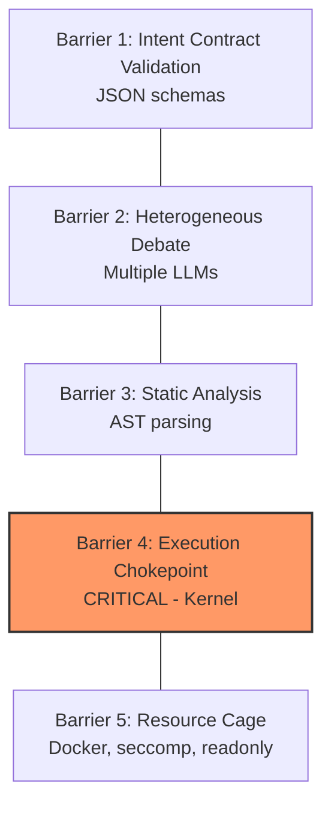

# Archon AI — Agent Guide

> **Constraint-Oriented Adaptive System (COAS)** — операционная среда для мультиагентных интеллектов с гарантиями безопасности через архитектурные ограничения.

**Version:** 0.1.0-alpha  
**Status:** Active Development  
**Language:** Python 3.11+

---

## Project Overview

Archon AI is a security-first multi-agent AI operating system. Unlike typical agent frameworks, it enforces strict architectural constraints to ensure agents cannot escape control or cause unauthorized state changes.

**Key Philosophy:**  
> Architecture-Bound AI: не "хороший ИИ", а система, где "плохой" невозможен по конструкции.

**Security Model: 5 Barriers + Execution Chokepoint**



---

## Quick Start

### Prerequisites
- Python 3.11+
- Poetry (recommended) or pip
- Docker & Docker Compose (optional, for deployment)
- Node.js ≥22 (for OpenClaw Gateway)

### Installation

```bash
# 1. Clone and setup Archon AI
git clone <repo>
cd archon_ai
make install

# 2. Clone your OpenClaw fork
git clone https://github.com/ember6784/open-llm.git claw
cd claw
pnpm install
cd ..
```

### Running with OpenClaw Gateway

```bash
# Terminal 1: Start OpenClaw Gateway
cd claw
pnpm gateway:dev
# Gateway will be available at ws://localhost:18789

# Terminal 2: Start Archon AI API
make run
# Or: uvicorn enterprise.api.main:app --reload --host 0.0.0.0 --port 8000
```

### Health Check

```bash
# Check Archon AI API
curl http://localhost:8000/health

# Check Gateway connection (via test)
pytest tests/integration/test_openclaw_gateway.py -v
```

---

## Project Structure

```
archon_ai/
├── enterprise/              # Security & Governance Layer
│   ├── api/
│   │   └── main.py          # FastAPI server (~778 lines)
│   ├── execution_contract.py # Intent validation (~629 lines)
│   ├── rbac.py              # Role-based access control (~656 lines)
│   ├── audit_logger.py      # Tamper-evident logging (~575 lines)
│   ├── event_bus.py         # Async pub/sub (~331 lines)
│   ├── gateway_bridge.py    # OpenClaw integration (~405 lines)
│   ├── config.py            # Pydantic settings (~194 lines)
│   └── main.py              # CLI entry point (~231 lines)
│
├── mat/                     # Multi-Agent Team (MAT)
│   ├── llm_router.py        # Multi-provider LLM integration (~997 lines)
│   ├── debate_pipeline.py   # DebateStateMachine (~1147 lines)
│   ├── siege_mode.py        # Offline autonomy (~740 lines)
│   ├── circuit_breaker.py   # 4-level autonomy system (~1084 lines)
│   ├── project_curator.py   # Meta-agent orchestration (~567 lines)
│   ├── agent_scoreboard.py  # Trust Score, NSGA-II (~853 lines)
│   ├── chaos_engine.py      # Adversarial testing (~280 lines)
│   └── agency_templates/    # Safety-vaccinated role templates
│       ├── template_loader.py
│       ├── safety_core.txt
│       └── roles/           # JSON role definitions
│           ├── builder.json
│           ├── skeptic.json
│           ├── auditor.json
│           └── ...
│
├── tests/
│   ├── unit/                # Unit tests
│   │   └── test_event_bus.py
│   └── integration/         # Integration tests
│       ├── test_full_flow.py
│       ├── test_intent_contract.py
│       └── test_kernel_integration.py
│
├── openclaw/                # External gateway integration
├── docs/                    # Architecture documentation (Russian)
├── docker-compose.yml       # Production stack
├── docker-compose.dev.yml   # Development stack
├── Dockerfile               # Production build
├── Dockerfile.dev           # Development build
├── Makefile                 # Command shortcuts
├── pyproject.toml           # Poetry dependencies & tool configs
└── .env.example             # Environment template
```

---

## Technology Stack

### Core Dependencies
| Category | Libraries |
|----------|-----------|
| Web Framework | FastAPI, Uvicorn, WebSockets |
| Async/Networking | aiohttp, aiofiles |
| Database | SQLAlchemy 2.0, asyncpg, Alembic |
| Cache | Redis (aioredis) |
| LLM Providers | openai, anthropic |
| Security | PyJWT, cryptography, passlib, python-keycloak |
| Observability | prometheus-client, opentelemetry, structlog |
| Data Validation | Pydantic v2, pydantic-settings |

### Development Tools
- **Linting:** Ruff (replaces flake8, black, isort)
- **Type Checking:** mypy
- **Testing:** pytest, pytest-asyncio, pytest-cov
- **Pre-commit:** pre-commit hooks

---

## Build & Test Commands

All commands are available via Makefile:

```bash
# Development
make install      # Install dependencies
make run          # Run API server locally (with reload)
make test         # Run all tests with coverage
make lint         # Run ruff and mypy
make format       # Auto-fix and format code

# Docker
make docker-build    # Build production images
make docker-up       # Start production stack
make docker-down     # Stop services
make docker-dev      # Start development environment
make docker-logs     # View API logs

# Utilities
make clean        # Remove __pycache__, .pyc, etc.
make health       # Check API health endpoint
make docs         # Show API documentation URLs
```

### Testing

```bash
# Run all tests
python -m pytest tests/ -v --cov=enterprise --cov=mat --cov-report=term-missing

# Run specific test file
pytest tests/integration/test_full_flow.py -v

# Run with asyncio
pytest tests/ -v --asyncio-mode=auto
```

---

## Code Style Guidelines

### Ruff Configuration (from pyproject.toml)
```toml
[tool.ruff]
line-length = 100
target-version = "py311"

[tool.ruff.lint]
select = ["E", "F", "I", "N", "W", "UP"]
ignore = ["E501"]  # Line too long (handled by formatter)

[tool.ruff.lint.isort]
known-first-party = ["enterprise", "mat", "openclaw"]
```

### Type Hints
- Use type hints for function signatures
- `disallow_untyped_defs = false` (relaxed for tests)
- Pydantic models for data validation

### Documentation Style
- Docstrings in English
- Comments in Russian for architectural explanations
- Module-level docstrings explaining purpose and usage

### Import Order
1. Standard library imports
2. Third-party imports
3. First-party imports (enterprise, mat, openclaw)

---

## Key Components

### Circuit Breaker (4-Level Autonomy)

```python
from mat import CircuitBreaker, AutonomyLevel, OperationType

cb = CircuitBreaker()
level = cb.check_level()  # GREEN, AMBER, RED, BLACK

if cb.can_execute(OperationType.MODIFY_CORE):
    # Execute operation
    pass
```

| Level | Trigger | Permissions |
|-------|---------|-------------|
| 🟢 GREEN | Human online | Full access |
| 🟡 AMBER | No contact 2h+ / backlog > 5 | No core/, canary only |
| 🔴 RED | No contact 6h+ / critical issues | Read-only + canary |
| ⚫ BLACK | 2+ critical failures | Monitoring only |

### Debate Pipeline

```python
from mat import DebatePipeline, LLMRouter

router = LLMRouter(quality_preference="balanced")
pipeline = DebatePipeline(llm_router=router)

result = await pipeline.debate_simple(
    code="def add(a, b): return a + b",
    requirements="Create a function that adds two numbers"
)
# Returns: verdict, confidence, consensus_score, final_code, etc.
```

### LLM Router

Supports 14+ models across 8 providers:
- **OpenAI:** GPT-4o, GPT-4o-mini
- **Anthropic:** Claude 3.5 Sonnet, Haiku
- **Google:** Gemini 2.5 Flash/Pro
- **Groq:** Llama 3.1/3.3 (FREE tier available)
- **xAI:** Grok
- **GLM:** GLM-4.7
- **HuggingFace:** Open-source models
- **Cerebras:** Llama 3.1 (very fast)

---

## Security Considerations

### Critical Invariants

1. **Kernel Trust Boundary:**  
   `Agent → Protocol Layer → Execution Kernel → Environment`  
   Agent has NO direct access to filesystem, network, tools, or LLM APIs.

2. **Fail-Closed Policy:**  
   All validation failures default to DENY.

3. **No LLM in Kernel:**  
   Kernel logic is deterministic only.

4. **Audit Logging:**  
   Fail-closed: if logging fails, operation is blocked.

### Authorized Kernel Operations (Whitelist)

```python
# File operations (sandbox only)
create_file(path, content)
modify_file(path, patch)
delete_file(path)  # non-critical paths only

# Execution (sandboxed)
run_test_in_sandbox(test_id)
run_linter_in_sandbox(files)

# Queries (read-only)
read_file(path)
search_code(query)

# Git (non-destructive)
create_branch(name)
commit_changes(message)  # auto-prefixed with [AGENT]

# All other operations — DENIED by default
```

### Chaos Monkey

Continuous adversarial testing that simulates:
- Circuit Breaker failures
- Compositional bypass attempts
- Timing attacks
- Intent Contract violations
- Kernel escape attempts

---

## Configuration

### Environment Variables

Copy `.env.example` to `.env` and configure:

```bash
# Required for LLM integration
OPENAI_API_KEY=sk-...
ANTHROPIC_API_KEY=sk-ant-...
GOOGLE_API_KEY=...
GROQ_API_KEY=gsk_...  # FREE option available

# Application
API_HOST=0.0.0.0
API_PORT=8000
LOG_LEVEL=INFO

# Database (optional)
POSTGRES_HOST=localhost
POSTGRES_PORT=5432
POSTGRES_DB=archon_ai
POSTGRES_USER=archon
POSTGRES_PASSWORD=changeme

# Security
SECRET_KEY=changeme-change-me-in-production
CORS_ORIGINS=http://localhost:3000,http://localhost:8000
```

### Pydantic Settings

Configuration is managed via `enterprise/config.py` using Pydantic Settings:

```python
from enterprise.config import settings

# Access settings
print(settings.app_name)
print(settings.database_url)
print(settings.is_production)
```

---

## Deployment

### Docker Compose (Production)

```bash
# Start all services
docker-compose up -d

# Services:
# - archon-api (port 8000)
# - postgres (port 5432)
# - redis (port 6379)
# - nginx (port 80/443, with production profile)
```

### Development Environment

```bash
make docker-dev
# Includes pgAdmin on http://localhost:5050
```

---

## API Endpoints

| Endpoint | Method | Description |
|----------|--------|-------------|
| `/health` | GET | Health check |
| `/api/v1/circuit_breaker/status` | GET | Get autonomy level |
| `/api/v1/circuit_breaker/record_activity` | POST | Record human activity |
| `/api/v1/siege/activate` | POST | Activate Siege Mode |
| `/api/v1/siege/deactivate` | POST | Deactivate Siege Mode |
| `/api/v1/debate/start` | POST | Start code review debate |
| `/api/v1/rbac/roles` | GET | List roles |
| `/api/v1/rbac/assign` | POST | Assign role to user |
| `/api/v1/audit/events` | GET | Query audit log |
| `/api/v1/audit/verify` | GET | Verify audit chain integrity |

---

## OpenClaw Integration

Archon AI integrates with OpenClaw Gateway (WebSocket) to receive messages from channels (Telegram, WhatsApp, Slack, etc.).

**📖 Full Guide:** [docs/integration/gateway.md](docs/integration/gateway.md)  
**🚀 Bot Quick Start:** [docs/getting-started/telegram-bot.md](docs/getting-started/telegram-bot.md)

### Quick Start with .env

```bash
# 1. Check environment
make check-env

# 2. Setup from .env
make setup-env

# 3. Start Gateway (Terminal 1)
cd claw && pnpm gateway:dev

# 4. Run with bot (Terminal 2)
make run-bot
```

### Environment Setup

| Command | Description |
|---------|-------------|
| `make check-env` | Verify all env variables |
| `make setup-env` | Create configs from .env |
| `make run-bot` | Start bot integration |

### Architecture


### Key Components

| Component | Purpose | Location |
|-----------|---------|----------|
| `GatewayClientV3` | WebSocket client with Protocol v3 handshake | `openclaw/gateway_v3.py` |
| `SecureGatewayBridge` | Security layer (RBAC, Kernel, Circuit Breaker) | `enterprise/openclaw_integration.py` |
| `test_gateway.py` | Quick connection test | Root |
| `test_real_messages.py` | Real message processing test | Root |
| `test_end_to_end.py` | Full E2E test with interactive mode | Root |

---

## Documentation

- `docs/vision.md` — Philosophy and universal laws
- `docs/adr/ADR-0001-enterprise-integration.md` — 5 Barriers architecture
- `docs/adr/ADR-0002-execution-chokepoint.md` — Execution Chokepoint RFC
- `docs/adr/ADR-0003-security-review.md` — Security review
- `docs/README.md` — Full documentation index

---

## Contributing Notes

1. **Security First:** All changes MUST preserve security invariants
2. **Kernel Changes:** Require formal verification planning
3. **Intent Contracts:** Changes need schema validation updates
4. **Tests:** All new features need integration tests

---

## License

- **Code:** MIT
- **Documentation:** CC-BY-SA

**Author:** ember6784
