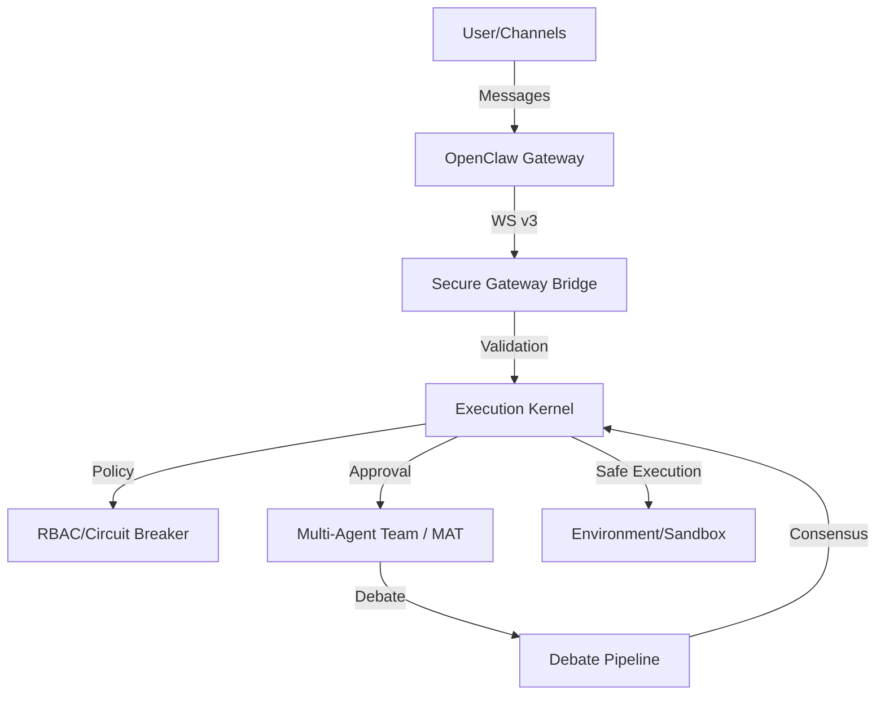

# Archon AI

> **Constraint-Oriented Adaptive System (COAS)** — операционная среда для мультиагентных интеллектов с гарантиями безопасности через архитектурные ограничения.

**Status:** Active Development | **Version:** 0.1.0-alpha | **Last Updated:** 2026-02-08

---

## 📚 Documentation

**Full documentation:** [docs/README.md](docs/README.md)

| Section | Description |
|---------|-------------|
| [Getting Started](docs/getting-started/quick-start.md) | Quick start guide |
| [Telegram Bot](docs/getting-started/telegram-bot.md) | @quant_dev_ai_bot setup |
| [Architecture](docs/README.md#architecture) | 5 Barriers, Kernel, Security |
| [API Reference](docs/reference/api.md) | REST API docs |
| [Commands](docs/reference/commands.md) | Command reference |

---

## 🚨 Integration Status

| Component | Status | Details |
|-----------|--------|---------|
| OpenClaw Gateway | ✅ Running | Port 18789 |
| Telegram Bot | ✅ Working | @quant_dev_ai_bot |
| Archon AI Kernel | ✅ Ready | ExecutionKernel + Circuit Breaker |
| Device Auth | ✅ Implemented | Ed25519 signing |

### High-Level Flow



Details: [docs/integration/status.md](docs/integration/status.md)

---

## System Classification

```
Type: Constraint-Oriented Adaptive System (COAS)
Primary control variable: constraint structure
Secondary: model intelligence
Safety model: Defense in depth with Execution Chokepoint
```

---

## Security Model

### Threat Model

Agents are assumed **hostile-by-complexity**:
- Can chain allowed operations into emergent effects
- Can generate code that spawns subprocesses
- Can exploit tool responses and hallucinated specifications
- Can induce humans via output manipulation
- Can use timing attacks and race conditions

**Security Goal:**  
No environment state change (Δ) is possible without validation by Execution Kernel.

**Security Invariant:**  
```
∀ state_change ∈ Environment : 
  origin(state_change) ∈ KernelApprovedOperations
```

**Non-goals:**
- Semantic alignment of agent values
- Intent understanding (intents are non-observable)
- Agent "morality" or "helpfulness"

### What This System Does NOT Protect Against

1. **Kernel compromise** — If Execution Kernel has bugs, all guarantees void
2. **Side-channel attacks** — Timing, resource exhaustion outside Kernel control
3. **Human override** — Authorized humans can bypass (by design)
4. **Supply chain** — Compromised dependencies, LLM API poisoning
5. **Physical access** — Host machine compromise

### Continuous Verification (Chaos Monkey)

**Principle:** Security is not proven by absence of attacks, but by survival of attacks.

Chaos Monkey is a **continuous adversarial auditor** running in parallel with the system:

```
┌─────────────────────────────────────────────┐
│  Chaos Engine (Adversarial Testing)         │
│  ├─ Simulates Circuit Breaker failures      │
│  ├─ Attempts compositional bypasses         │
│  ├─ Injects timing attacks                  │
│  ├─ Tests Intent Contract edge cases        │
│  └─ Attempts Kernel escape vectors          │
└─────────────────────────────────────────────┘
                      ↓
           Reports to Security Monitor
```

**Attack Vectors Tested:**
- **Circuit Breaker**: Force state transitions, test race conditions
- **Intent Verifier**: Submit contracts with hidden invariant violations
- **Execution Kernel**: Attempt side-channel escapes, resource exhaustion
- **Debate Layer**: Inject consensus attacks, test correlation failures

**Success Criteria:**
- All attacks MUST be contained by appropriate Barrier
- Kernel MUST reject unauthorized state changes
- Alerts MUST fire within 5 seconds of containment failure

**Note:** Chaos Monkey operates with "unknown unknowns" assumption — it tests not just defined threats, but emergent behavior.

---

## Architecture: 5 Barriers + Execution Chokepoint

**Barrier Classification:**
- **Enforcement Barriers** (4, 5): Physical/OS-level blocks
- **Validation Barriers** (1, 3): Logical checks
- **Confidence Barrier** (2): Cognitive redundancy, NOT security guarantee

```
┌─────────────────────────────────────────────────────────────────┐
│  HUMAN OBSERVER (Creator/Admin)                                 │
│  └─ Defines constraints, monitors all levels                    │
├─────────────────────────────────────────────────────────────────┤
│  BARRIER 1: Intent Contract Consistency Check                   │
│  └─ Type: Validation (Logical)                                 │
│  └─ JSON contract validation (pre/post-conditions)             │
│  └─ ⚠️ Incentives shape behavior, NOT security guarantee       │
├─────────────────────────────────────────────────────────────────┤
│  BARRIER 2: Heterogeneous Debate                                │
│  └─ Type: Confidence (Cognitive Redundancy)                    │
│  └─ Multiple LLM families reduce correlated errors             │
│  └─ ⚠️ NOT a security barrier — enhances confidence only       │
├─────────────────────────────────────────────────────────────────┤
│  BARRIER 3: Static Analysis                                     │
│  └─ Type: Validation (Formal)                                  │
│  └─ AST parsing, dependency checking                           │
├─────────────────────────────────────────────────────────────────┤
│  BARRIER 4: Execution Chokepoint (CRITICAL)                     │
│  └─ Type: Enforcement (Physical/OS-level)                      │
│  └─ SINGLE entry point for ALL environment mutations           │
│  └─ Circuit Breaker integrated into Kernel decision path       │
│  └─ Kernel NEVER executes agent code (predefined ops only)     │
├─────────────────────────────────────────────────────────────────┤
│  BARRIER 5: Resource Cage + State Diff                          │
│  └─ Type: Enforcement (Runtime)                                │
│  └─ Docker namespaces, seccomp whitelist, readonly root FS     │
│  └─ Capability dropping, no_new_privileges                     │
└─────────────────────────────────────────────────────────────────┘
```

### Execution Chokepoint — Trust Boundary

**Architecture:**
```
Agent → Protocol Layer → Execution Kernel → Environment
              ↑
         Trust Boundary
```

**Agent has NO direct access to:**
- File system
- Network
- Tools/Instruments
- LLM APIs
- Memory stores

**Kernel Decision Path (all must pass):**
1. Intent Contract consistency check
2. RBAC permission verification  
3. **Circuit Breaker state check** — integrated into Kernel (not separate service)
4. Resource limits (tokens, time, memory)
5. Audit logging (hash-chained) — **fail-closed: if logging fails, operation blocked**
6. **Can REJECT** — safety > progress

### Kernel Trust Boundary

Execution Kernel is the **highest-trust component** and **single point of failure**.

**Mitigations:**
- Minimal code surface (lines of code budget)
- NO LLM inside Kernel (deterministic logic only)
- **Kernel NEVER executes agent-generated code** — only predefined operations
- Formal verification: Z3 SMT solver (current), TLA+/Coq for critical paths (future)
- External security audit required before production
- Memory-safe language (Rust planned for v2)

**Kernel Authorized Operations (Whitelist):**
```python
# File operations (only within sandbox)
create_file(path: Path, content: str)
modify_file(path: Path, patch: Diff)
delete_file(path: Path)  # only non-critical paths

# Execution (sandboxed only)
run_test_in_sandbox(test_id: str)
run_linter_in_sandbox(files: List[Path])

# Queries (read-only)
read_file(path: Path)
search_code(query: str)
get_dependencies(file: Path)

# Git (non-destructive)
create_branch(name: str)
commit_changes(message: str)  # auto-prefixed with [AGENT]

# All other operations — DENIED by default
```

### Fail-Closed Policy

All validation failures default to **DENY**:

| Failure Mode | Behavior |
|--------------|----------|
| Audit logging fail | Operation blocked (cannot proceed unaudited) |
| Validation timeout | Operation blocked (assume hostile) |
| Resource monitor unavailable | Operation blocked (no limits = no execution) |
| Circuit Breaker state unclear | Default to most restrictive level |
| Kernel internal error | Halt agent, alert human |

**Principle:** When in doubt, stop. Progress is optional, safety is mandatory.

### OS-Level Isolation (Resource Cage)

**Current/Planned:**

| Mechanism | Purpose | Status |
|-----------|---------|--------|
| Docker user namespaces | UID/GID isolation | Planned |
| seccomp whitelist | Syscall filtering | Planned |
| `no_new_privileges` | Prevent privilege escalation | Planned |
| Network namespace | Network isolation | Planned |
| Read-only root FS | Immutable base image | Planned |
| OverlayFS | Writable layer with diff/rollback | Planned |
| Capability dropping | Remove unused Linux caps | Planned |
| eBPF monitoring | Runtime syscall monitoring | Future |

**Security Invariant:**  
Agent process cannot perform syscalls outside whitelist, cannot access host resources, cannot escalate privileges.

---

## Circuit Breaker: 4 Autonomy Levels

| Level | Trigger | Permissions | Protected Paths |
|-------|---------|-------------|-----------------|
| 🟢 **GREEN** | Human online | Full | All |
| 🟡 **AMBER** | No contact 2h+ / backlog > 5 | No core/, canary only | Requires approval for critical |
| 🔴 **RED** | No contact 6h+ / critical issues | Read-only + canary | Write blocked |
| ⚫ **BLACK** | 2+ critical failures | Monitoring only | All changes blocked |

**Use case:** Creator availability constraints (war zones, connectivity issues, sleep).

---

## Incentive Design (Game Theory)

**⚠️ IMPORTANT:** Incentive system shapes agent behavior and improves task quality.  
**It is NOT a security barrier.** LLMs do not "fear" penalties or "seek" rewards in the agentic sense.

```python
# Intent Contract Example
{
  "task_id": "refactor_auth",
  "risk_level": "AMBER",
  "max_tokens": 15000,
  "constraints": {
    "pre_conditions": ["tests_pass", "no_core_changes"],
    "post_conditions": ["tests_still_pass", "audit_logged"],
    "invariants": ["auth_core_immutable"]
  },
  "penalties": {
    "security_vuln": -0.8,
    "timeout": -0.3,
    "invariant_violation": -1.0
  },
  "rewards": {
    "clean_execution": +0.4,
    "test_pass": +0.3,
    "cost_efficiency": +0.2
  }
}
```

**Trust Score effects:**
- Tool access level
- Context window size
- Auto-approval eligibility
- Agent survival (auto-disable threshold: 0.3)

---

## Project Structure

```
archon_ai/
├── enterprise/              # Security & Governance Layer
│   ├── api/
│   │   ├── __init__.py
│   │   └── main.py          # ~778 lines - FastAPI server with OpenAPI
│   ├── execution_contract.py# ~629 lines - Intent validation
│   ├── rbac.py              # ~656 lines - Role-based access control
│   ├── audit_logger.py      # ~575 lines - Tamper-evident logging
│   ├── event_bus.py         # ~331 lines - Async pub/sub
│   ├── gateway_bridge.py    # ~405 lines - OpenClaw integration
│   ├── config.py            # ~194 lines - Configuration
│   └── main.py              # ~231 lines - Entry point
│
├── mat/                     # Multi-Agent Team Logic (production code from multi_agent_team)
│   ├── llm_router.py        # ~997 lines - Multi-provider LLM integration
│   ├── debate_pipeline.py   # ~1147 lines - DebateStateMachine (from multi_agent_team)
│   ├── siege_mode.py        # ~740 lines - Offline autonomy
│   ├── rbac.py              # (moved to enterprise)
│   ├── circuit_breaker.py   # ~1084 lines - 4-level autonomy (from multi_agent_team)
│   ├── project_curator.py   # ~567 lines - Meta-agent orchestration
│   ├── agent_scoreboard.py  # ~853 lines - Trust Score, NSGA-II (from multi_agent_team)
│   ├── chaos_engine.py      # ~280 lines - Adversarial testing
│   ├── agency_templates/
│   │   ├── __init__.py
│   │   ├── template_loader.py   # ~317 lines
│   │   ├── index.json           # ~70 lines
│   │   ├── safety_core.txt      # ~80 lines
│   │   └── roles/
│   │       ├── _base.json
│   │       ├── builder.json     # ~45 lines - Builder agent
│   │       ├── skeptic.json     # ~55 lines - Security reviewer
│   │       ├── auditor.json     # ~60 lines - Final decision maker
│   │       ├── security_expert.json
│   │       ├── performance_guru.json
│   │       ├── database_architect.json
│   │       ├── ux_researcher.json
│   │       └── devops_engineer.json
│   └── __init__.py           # Package exports
│
├── tests/
│   ├── unit/
│   │   └── test_event_bus.py # ~224 lines
│   └── integration/
│       ├── __init__.py
│       └── test_full_flow.py # ~425 lines - Integration tests
│
├── openclaw/                # External: OpenClaw Gateway
│   ├── __init__.py
│   ├── gateway.py
│   └── channels.py
│
├── Dockerfile               # Production build
├── Dockerfile.dev           # Development build
├── docker-compose.yml       # Production stack
├── docker-compose.dev.yml   # Development stack
├── Makefile                 # Command shortcuts
├── .env.example             # Environment configuration
├── pyproject.toml           # Poetry dependencies
├── README.md                # This file
├── AGENTS.md                # Agent guide (for AI assistants)
└── docs/                    # Documentation (see docs/README.md)
```

---

## Implementation Status

### ✅ Phase 0-3 Complete (Core Safety + LLM Integration + Production Code from multi_agent_team)

| Component | File | Lines | Status |
|-----------|------|-------|--------|
| **Phase 0: Foundation** | | | |
| Execution Contract | `enterprise/execution_contract.py` | ~629 | ✅ |
| Event Bus | `enterprise/event_bus.py` | ~331 | ✅ |
| Gateway Bridge | `enterprise/gateway_bridge.py` | ~405 | ✅ |
| Config | `enterprise/config.py` | ~194 | ✅ |
| **Phase 1: MAT Integration** | | | |
| LLM Router | `mat/llm_router.py` | ~997 | ✅ |
| DebateStateMachine | `mat/debate_pipeline.py` | ~1147 | ✅ (from multi_agent_team) |
| Siege Mode | `mat/siege_mode.py` | ~740 | ✅ |
| Project Curator | `mat/project_curator.py` | ~567 | ✅ |
| Circuit Breaker | `mat/circuit_breaker.py` | ~1084 | ✅ (from multi_agent_team) |
| Agent Scoreboard | `mat/agent_scoreboard.py` | ~853 | ✅ (from multi_agent_team) |
| Chaos Engine | `mat/chaos_engine.py` | ~280 | ✅ |
| Agency Templates | `mat/agency_templates/` | ~467 | ✅ |
| **Phase 2: Enterprise Layer** | | | |
| RBAC System | `enterprise/rbac.py` | ~656 | ✅ |
| Audit Logger | `enterprise/audit_logger.py` | ~575 | ✅ |
| FastAPI Server | `enterprise/api/main.py` | ~778 | ✅ |
| **Phase 3: LLM Integration** | | | |
| Role Templates (Builder/Skeptic/Auditor) | `mat/agency_templates/roles/` | ~160 | ✅ |
| Integration Tests | `tests/integration/` | ~425 | ✅ (17/17 passing) |
| Unit Tests | `tests/unit/` | ~224 | ✅ |
| **Deployment** | | | |
| Dockerfile | `Dockerfile` | ~50 | ✅ |
| Dockerfile.dev | `Dockerfile.dev` | ~40 | ✅ |
| docker-compose.yml | `docker-compose.yml` | ~120 | ✅ |
| docker-compose.dev.yml | `docker-compose.dev.yml` | ~90 | ✅ |
| Makefile | `Makefile` | ~80 | ✅ |
| .env.example | `.env.example` | ~130 | ✅ |
| **TOTAL** | | **~10,500** | **26 Python files** |

### ⚠️ In Progress (Critical Path)
| Component | Status | Notes |
|-----------|--------|-------|
| **Execution Kernel** | Design Phase | Requires formal verification planning |
| Intent Contract Validator | Ready for Integration | LLM Router available |
| DebateStateMachine | Complete | Full pipeline from multi_agent_team |

### ❌ Not Started
| Component | Priority |
|-----------|----------|
| Graph Memory (PostgreSQL JSONB) | P2 |
| Formal verification specs | P2 |
| Chaos Monkey testing framework | P2 |

---

## LLM Integration Details (Phase 3 - Complete)

### Supported Providers
| Provider | Models | Task Types |
|----------|--------|------------|
| OpenAI | gpt-4o, gpt-4o-mini | CODE_GENERATION, CODE_REVIEW |
| Anthropic | claude-3.5-sonnet, claude-3-haiku | CODE_ANALYSIS, CODE_REVIEW |
| Google | gemini-2.5-flash, gemini-2.5-pro | GENERAL, CODE_GENERATION |
| Groq | llama-3.1-8b, llama-3.3-70b | CODE_GENERATION (fast) |
| xAI | grok-beta | GENERAL |
| GLM | glm-4.7 | CODE_ANALYSIS |
| HuggingFace | phi-3, mistral-7b | GENERAL |
| Cerebras | llama-3.1-8b | CODE_GENERATION |

### Debate Pipeline with LLM (DebateStateMachine from multi_agent_team)
```
DRAFT → Builder (fast models) proposes code
  ↓
NORMALIZE_SEMANTIC → Canonicalize logic
  ↓
SIEGE → Skeptic (thorough models) finds vulnerabilities
  ↓
FORTIFY → Builder addresses concerns (with constraints!)
  ↓
NORMALIZE_SYNTAX → Black/Ruff formatting
  ↓
FINAL_ASSAULT → Skeptic verifies fixes
  ↓
FREEZE → Lock artifacts
  ↓
JUDGMENT → Auditor (balanced models) makes verdict

Plus FEEDBACK LOOP STATES:
- ASSIGN_FIXER → FIX → VERIFY → RE_DEBATE
And EVOLUTION CYCLE:
- EVOLUTION_START → STAGNATION_CHECK → GROUNDING → FRESH_EYE → SENIOR_AUDITOR → VETO_POWER
```

**Features:**
- Event Sourcing with JSONL history
- AST Fingerprinting for structural code analysis
- EntropyMarkers for reproducibility
- ConsensusCalculatorV3 for verdict analysis
- StateContracts for validation

---

## Quick Start

### Requirements
- Python 3.11+
- Poetry (or pip)
- Docker & Docker Compose (optional)

### Install

```bash
# Clone repository
git clone https://github.com/ember6784/archon_ai.git
cd archon_ai

# Install dependencies
pip install fastapi uvicorn anthropic openai aiohttp

# (Optional) Set API keys for LLM integration
export OPENAI_API_KEY="sk-..."
export ANTHROPIC_API_KEY="sk-ant-..."
export GOOGLE_API_KEY="..."
export GROQ_API_KEY="gsk_..."
export XAI_API_KEY="..."
export GLM_API_KEY="..."
export HF_API_KEY="..."

# Run API server
uvicorn enterprise.api.main:app --reload --host 0.0.0.0 --port 8000
```

### Production Deployment

See [PRODUCTION_WORKFLOW.md](PRODUCTION_WORKFLOW.md) for:
- Docker Compose setup with full stack
- Environment configuration
- Security hardening checklist
- Monitoring and alerting setup

### Verify

```bash
# Health check
curl http://localhost:8000/health

# Circuit breaker status
curl http://localhost:8000/api/v1/circuit_breaker/status

# Audit log verification
curl http://localhost:8000/api/v1/audit/verify

# Start a debate (with LLM)
curl -X POST http://localhost:8000/api/v1/debate/start \
  -H "Content-Type: application/json" \
  -d '{
    "code": "def add(a, b): return a + b",
    "requirements": "Create a function that adds two numbers"
  }'
```

### API Documentation
- Swagger UI: http://localhost:8000/docs
- ReDoc: http://localhost:8000/redoc

---

## Compliance Notes

Architecture is **designed to be compatible** with:
- SOC2 Type II (access control, change management)
- GDPR (audit trails, data processing boundaries)

**Not yet:** Organizationally implemented or certified.

---

## Limitations & Risks

1. **Kernel is SPOF** — Compromise = total system failure
2. **Debate reduces correlation, not malice** — LLMs share training data
3. **No formal verification yet** — Security arguments are architectural, not mathematical
4. **Side channels exist** — Resource timing, cache analysis not mitigated
5. **Human in the loop** — Can be socially engineered

---

## Roadmap

### Phase 1: Execution Kernel (Current)
- [ ] Formal specification
- [ ] Reference implementation (Python)
- [ ] RBAC + Circuit Breaker integration
- [ ] LLM Router binding

### Phase 2: Validation Layers
- [ ] Intent Contract Consistency Check
- [ ] DebateOrchestrator integration
- [ ] Static Analysis pipeline
- [ ] Chaos Engine (continuous adversarial testing)

### Phase 3: Memory & Reflection
- [ ] Graph Memory (PostgreSQL JSONB)
- [ ] Batch Reflection (local Llama)

### Phase 4: Hardening
- [ ] External security audit
- [ ] Rust Kernel v2
- [ ] Formal verification specs

---

## Contributing

This is a research system. Before contributing:
1. Read `docs/threat_model.md` (when available)
2. Understand Kernel Trust Boundary
3. All changes MUST preserve security invariants

---

**Author:** ember6784  
**License:** MIT (code) / CC-BY-SA (docs)  
**Contact:** See repository issues

---

## References

- `docs/vision.md` — Philosophy (not engineering)
- `docs/adr/ADR-0001-enterprise-integration.md` — 5 Barriers architecture
- `docs/adr/ADR-0002-execution-chokepoint.md` — Execution Chokepoint RFC
- `docs/adr/ADR-0003-security-review.md` — Security review (this document's critique)
- `docs/DEVELOPER_GUIDE.md` — Developer guide
- `docs/CONTRIBUTING.md` — Contribution guidelines
