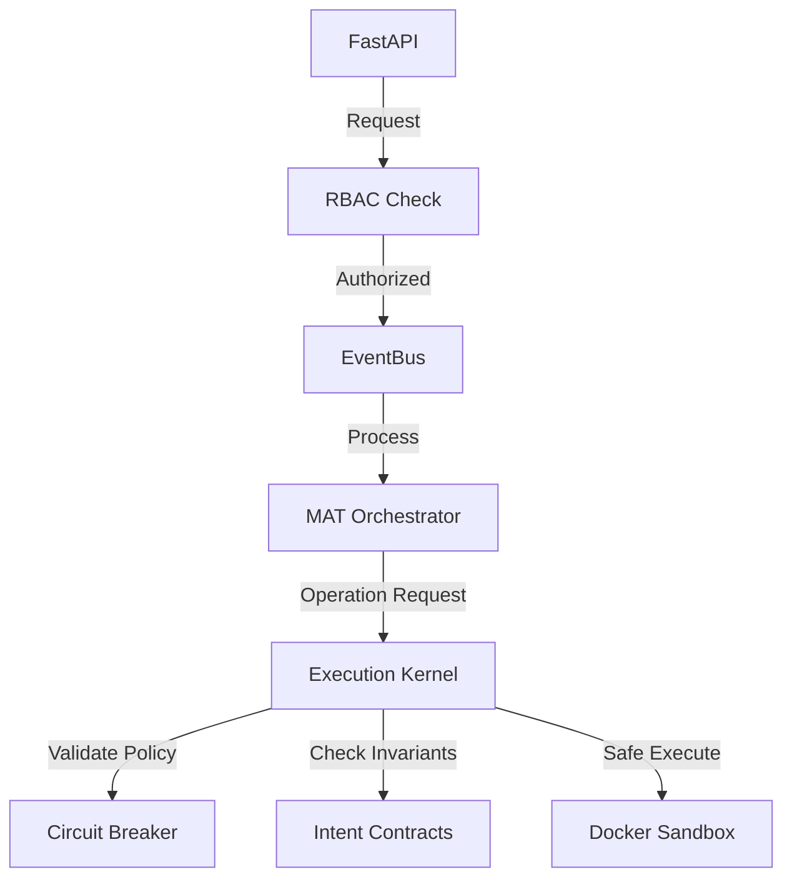

# Archon AI Developer Guide

Welcome to the Archon AI developer guide. This document provides a deep dive into the technical architecture, component interactions, and development workflows.

## Architecture Deep Dive

Archon AI is built on the **Constraint-Oriented Adaptive System (COAS)** model. The core principle is that safety is enforced through architectural constraints rather than agent behavior.

### Component Interaction Flow

1. **EventBus**: The central nervous system for asynchronous communication. Components subscribe to topics and publish events without direct coupling.
2. **RBAC**: Enforces role-based access control at the API and Kernel levels.
3. **ExecutionKernel**: The single chokepoint for all environment mutations. It validates every operation against active policies and invariants.



## Component Guide

### `enterprise` Layer
The governance layer of the system.
- **API**: Located in `enterprise/api/main.py`. Handles REST requests and WebSocket connections.
- **Audit Logging**: Implemented in `enterprise/audit_logger.py`. Uses a hash-chained structure to ensure tamper-evidence.
- **RBAC**: Defines roles and permissions in `enterprise/rbac.py`.

### `mat` (Multi-Agent Team)
The cognitive layer where agent logic resides.
- **LLM Router**: Multi-provider integration (`mat/llm_router.py`). Handles failover and model selection.
- **Debate Pipeline**: A state machine driven process for achieving consensus (`mat/debate_pipeline.py`).
- **Adding Agent Roles**: New roles can be defined in `mat/agency_templates/roles/` as JSON files. Use `_base.json` as a template.

### `kernel` Layer
The trusted boundary.
- **Intent Contracts**: Located in `kernel/intent_contract.py`. Defines pre/post conditions for operations.
- **Invariants**: Safety properties that must hold true before and after any execution (`kernel/invariants.py`).

## Local Development

### Debugging
Use the `LOG_LEVEL=DEBUG` environment variable to see detailed execution logs.

### Docker Development
Run `make docker-dev` to start the development environment with PostgreSQL and Redis.
Access pgAdmin at `http://localhost:5050` (credentials in `docker-compose.dev.yml`).

### Log Analysis
Logs are structured using `structlog`. You can pipe them to a tool like `jq` for easier reading:
```bash
tail -f logs/archon.log | jq .
```

## Testing Standards

### Unit Tests
Located in `tests/unit/`. Focus on individual component logic.
Run with: `pytest tests/unit`

### Integration Tests
Located in `tests/integration/`. Test full flows including LLM interactions and Kernel validation.
Run with: `pytest tests/integration`

### Benchmarking
Performance is critical for the Kernel. Use the benchmark suite to measure latency:
```bash
pytest tests/integration/test_kernel_perf.py
```

## Glossary of Architectural Terms
- **COAS**: Constraint-Oriented Adaptive System.
- **Execution Chokepoint**: A single point through which all mutations must pass.
- **Siege Mode**: Fully offline autonomy mode when human contact is lost.
- **5 Barriers**: The multi-layered defense model (Intent, Debate, Static Analysis, Kernel, Sandbox).
