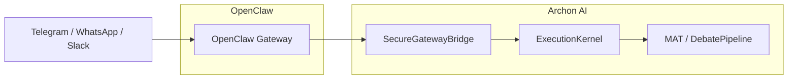
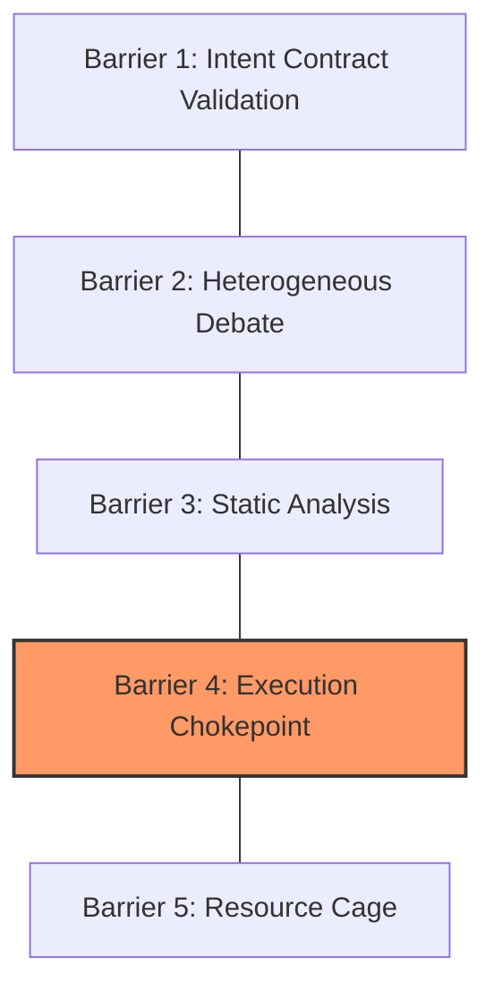

# OpenClaw + Archon AI: Enterprise Integration Architecture

## Overview

OpenClaw is a multi-channel AI assistant infrastructure. Archon AI adds a security and governance layer on top, transforming it into a production-grade, high-assurance platform.

| Component | Description |
|-----------|-------------|
| Gateway   | WebSocket control plane (port 18789) |
| Channels  | WhatsApp, Telegram, Slack, Discord, Google Chat, Signal, iMessage, Teams, Matrix |
| Apps      | macOS menu bar, iOS/Android nodes |
| Voice     | Wake + Talk Mode with ElevenLabs |
| Canvas    | A2UI (agent-driven visual workspace) |
| Browser   | CDP control via Chrome/Chromium |
| Runtime   | Node.js ≥22, TypeScript |

---

## Integration Architecture



### Layer Breakdown

| Layer | Provider | Responsibility |
|-------|----------|----------------|
| Channels Layer | OpenClaw | 12+ communication channels |
| Gateway Layer | OpenClaw | WebSocket control plane |
| Security Layer | Archon AI | Circuit Breaker, RBAC, Audit |
| Execution Layer | Archon AI | Kernel, Intent Contracts, Invariants |
| Sandbox Layer | OpenClaw + Docker | Isolated code execution |

---

### 5-Layer Defense Model



### What Each Side Contributes

| OpenClaw provides | Archon AI adds |
|-------------------|----------------|
| 12+ communication channels | 4 autonomy levels (GREEN/AMBER/RED/BLACK) |
| WebSocket control plane | Project Curator (meta-agent) |
| Docker sandboxing | Debate Pipeline (collective decisions) |
| Voice + Canvas UI | Siege Mode (full offline autonomy) |
| Tailscale Serve | Safety Core (vaccinated agents) |
| macOS/iOS/Android apps | Agent Scoreboard (performance metrics) |

---

## RBAC Matrix by Autonomy Level

| Role      | GREEN               | AMBER                  | RED              | BLACK            |
|-----------|---------------------|------------------------|------------------|------------------|
| Admin     | All operations      | Includes core/*        | Canary only      | Monitoring only  |
| Developer | All operations      | core/* blocked         | Read-only        | Blocked          |
| Analyst   | Read only           | Read only              | Blocked          | Blocked          |
| External  | Requires approval   | Blocked                | Blocked          | Blocked          |

---

## Key Integration Points

### Smart Gateway (EnterpriseGateway)
Intercepts all channel messages and routes them through RBAC and Circuit Breaker before execution. If autonomy level is BLACK, execution is blocked at the entry point.

### Adaptive Sandbox (EnterpriseSandbox)
Extends the standard Docker Sandbox. Container configuration (CPU, memory limits, network policies) is dynamically generated based on user role and autonomy level:

- **GREEN**: Full network and file access
- **AMBER**: Network restricted to specific APIs, CPU limited
- **RED/BLACK**: Read-only access, network disabled

### Debate Pipeline with Compliance
In the enterprise environment, a virtual "Compliance Officer" agent is automatically added to debates when actions involve regulated data (GDPR). Critical decisions transition to `awaiting_approval` status for human confirmation.

---

## Deployment Strategy

### Target: Linux (Ubuntu Server)
- Native Docker/Kubernetes support
- ZeroMQ IPC via Unix sockets (microsecond latency)
- Full Python ecosystem for ML/AI operations

### Windows Support
- Docker Desktop with `docker-compose` (recommended)
- WSL2 for development environments
- TCP loopback `127.0.0.1:5555` for ZeroMQ (≈0.1ms latency)

### Cross-Platform Path Handling
```python
from pathlib import Path
base_path = Path(__file__).parent.parent / "data" / "logs"
```

Use `pathlib` in Python and `path.join()` in Node.js. Never hardcode OS-specific path separators.

---

## Resilience Scenarios

### Scenario 1: Security Breach + Privilege Escalation
An attacker gains access to a junior developer's Slack account and attempts to delete audit logs and request root access.

**Defense:**
1. RBAC blocks `audit_delete` for Developer role
2. Intent Contract detects semantic violation (destructive + escalation pattern)
3. Circuit Breaker remains in current level — no escalation possible
4. Audit Trail records the blocked attempt (immutable, hash-chained)

### Scenario 2: Cascade Failure + Siege Mode
System is in AMBER, external API connectivity is lost, and a Docker process starts consuming all host memory.

**Defense:**
1. `DynamicCircuitBreaker` detects loss of human contact and escalates to RED/BLACK
2. Siege Mode activates autonomously
3. Resource monitor triggers SIGKILL on the runaway container
4. On reconnection, a "Virtual CTO" report is generated with full action audit

### Scenario 3: Hallucination in Debate Pipeline
An agent proposes a library update containing a supply-chain vulnerability.

**Defense:**
1. Safety Core runs static analysis (AST + known CVE check) before any proposal is accepted
2. Industrial Indexer verifies dependency graph impact across the codebase
3. If no consensus, operation is blocked pending human review

---

## Backup Strategy

Before any file-modifying operation approved by the Execution Kernel:

1. **Snapshot**: Create a git commit to a temporary branch (`_archon_snapshot_<timestamp>`)
2. **Execute**: Perform the operation inside the sandbox
3. **Verify**: Run post-condition invariants
4. **Commit or Rollback**: On invariant failure, revert to snapshot

This ensures any agent-driven change can be rolled back deterministically.
