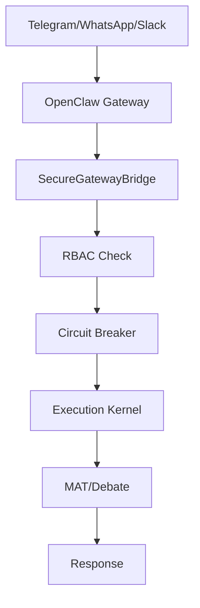
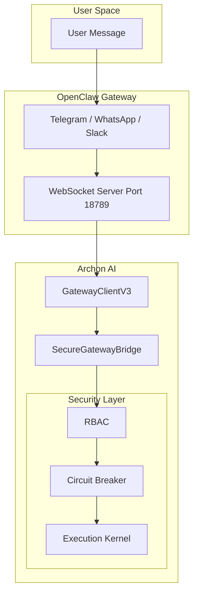
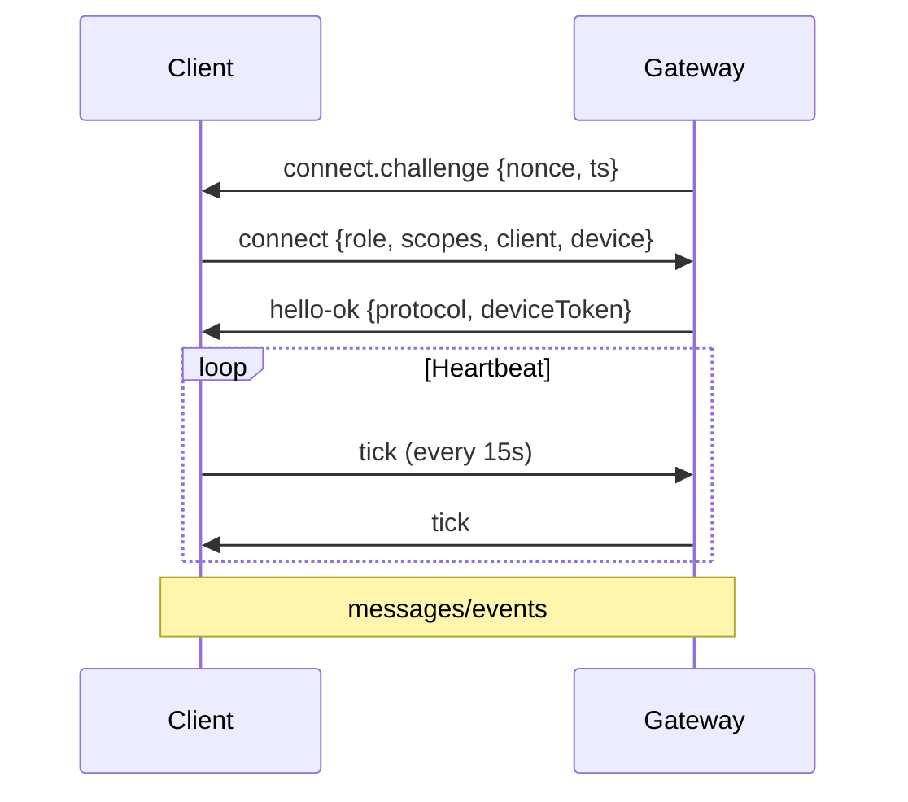

# Quick Start Guide

Запуск Archon AI с OpenClaw Gateway за 5 минут.

---

## Prerequisites

- Python 3.11+
- Poetry или pip
- Docker & Docker Compose (опционально)
- Node.js ≥22 (для OpenClaw Gateway)

---

## Installation

### 1. Clone and Setup

```bash
# Clone Archon AI
git clone <repo>
cd archon_ai
make install

# Clone OpenClaw fork (for Gateway)
git clone https://github.com/ember6784/open-llm.git claw
cd claw
pnpm install
cd ..
```

### 2. Environment Setup

```bash
# Copy environment template
cp .env.example .env

# Edit with your keys
# Required: OPENAI_API_KEY, ANTHROPIC_API_KEY (for LLM)
# Optional: TELEGRAM_BOT_TOKEN (for bot)
```

---

## Running

### Option A: Development Mode

```bash
# Terminal 1: Start OpenClaw Gateway
cd claw
pnpm gateway:dev
# Gateway: ws://localhost:18789

# Terminal 2: Start Archon AI API
make run
# API: http://localhost:8000
```

### Option B: Docker Compose

```bash
# Full stack
make docker-up

# Or with Gateway
make fullstack-up
```

### Option C: With Telegram Bot

```bash
# 1. Start Gateway
cd claw && pnpm gateway:dev

# 2. Run bot
make run-bot
# Or: python run_quant_bot.py
```

---

## Verification

### Health Check

```bash
# Check Archon AI API
curl http://localhost:8000/health

# Check Gateway
curl http://localhost:18789/health
```

### Test Connection

```bash
# Gateway connection test
python test_gateway.py

# Full E2E test
python test_end_to_end.py --interactive
```

---

## What Happens When You Send a Message



---

## Architecture Overview



---

## Protocol v3 Handshake



---

## Next Steps

1. **Configure your bot**: See [Telegram Bot Guide](telegram-bot.md)
2. **Learn the architecture**: See [Vision & Philosophy](../vision.md)
3. **API reference**: See [API Endpoints](../reference/api.md)
4. **Commands**: See [Commands Reference](../reference/commands.md)

---

## Troubleshooting

### Connection refused

```bash
# Check Gateway is running
curl http://localhost:18789/health

# Check port
netstat -an | grep 18789
```

### Protocol mismatch

- Gateway must send `connect.challenge` before handshake
- Both sides must support Protocol v3

### Authentication failed

- Ensure `role="operator"` and correct scopes
- For production: configure device fingerprint

---

## Quick Reference Commands

| Command | Description |
|---------|-------------|
| `make install` | Install dependencies |
| `make run` | Start API server |
| `make test` | Run all tests |
| `make gateway-dev` | Start Gateway |
| `make run-bot` | Run with Telegram bot |
| `make check-env` | Verify environment |
